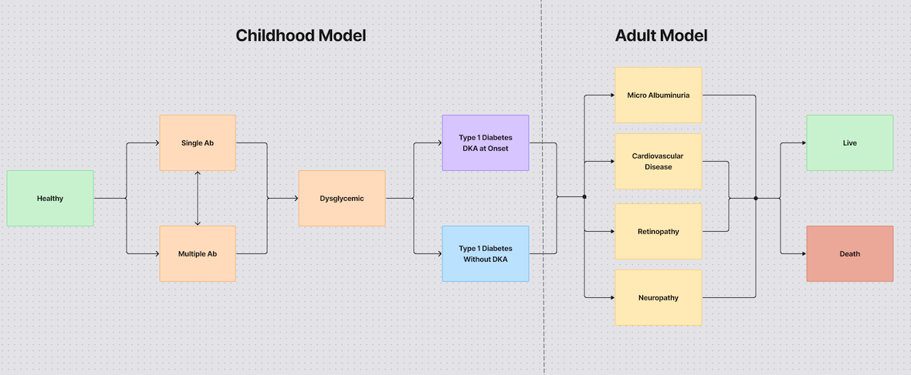

# Development of a Patient-Level Multi-Objective Optimisation Budget Impact Model for Screening Strategies for Childhood Type 1 Diabetes


## Lifetime Modelling Diagram


File structure overview:

```
Dockerfile                          # add docker?
LICENSE
README.md                          # Documentation (this file)
background_population_grs.csv      # Background data to compute GRS2 in population
requirements.txt                   # Python dependencies
simulation_package                 # Directory with core simulation and optimisation modules
├── [disease_state].py             # Modules defining T1D disease state 
├── objective_function_dka.py      # Module that defines an ObjectiveFunctionDKA class (minimise DKA)
├── objective_function_costs.py    # Module that defines an ObjectiveFunctionCosts class (minimise costs)
├── screening.py                   # Module that defines a Screening class (simulates screening)
├── screening_intervention.py      # Module that defines a ScreeningIntervention class (effect of screening)
├── run_simulation.py              # Run Vivarium simulation (no optimisation)
├── run_optimisation.py            # Run Vivarium simulation + multi-objective optimisation
├── optimisation_problem_object.py # Pymoo optimisation problem definition
└── [other].py                     # Additional utilities and observers 
tests                              # Directoryt with unit tests for simulation modules
└── simulation_tests
    └── test_[module].py
transition_probabilities
└── binary_files                   # Survival regression model binaries for transition probabilities
    ├── [state_transition].bin
    └── RiskTable.csv              # risk table for adult simulations
```


# How to Run Vivarium Simulations

```shell
python simulation_package/fire_simulation.py
```


# Run Vivarium Simulations + Multi-Objective Optimisation

```shell
python simulation_package/run_optimisation.py
```


